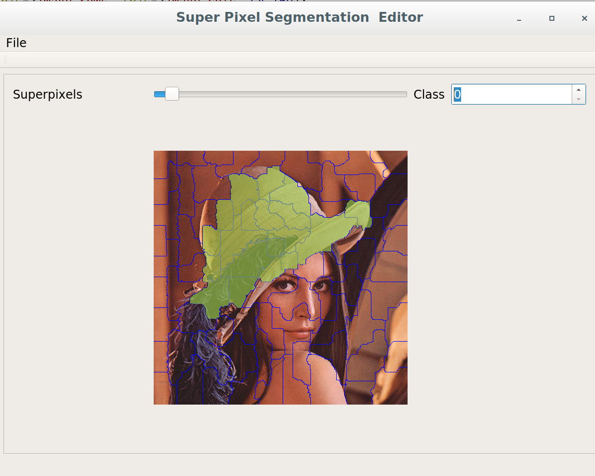
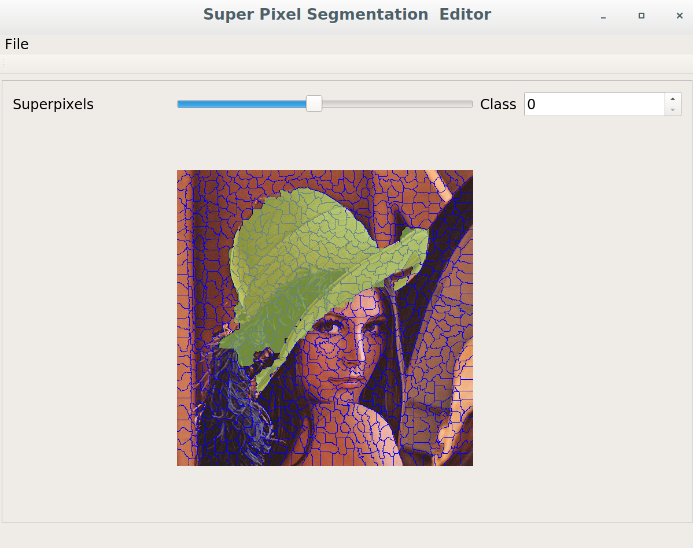

# SuperPixelSegmentationEditor
Editor for image segmentation using super pixels and storing to png file format.





# Docker
 You can run this program in docker container

```bash
xhost +
docker run --rm -e DISPLAY=$DISPLAY -e QT_X11_NOMITSHM=1 -v /tmp/.X11-unix:/tmp/.X11-unix chriamue/SuperPixelSegmentationEditor
```